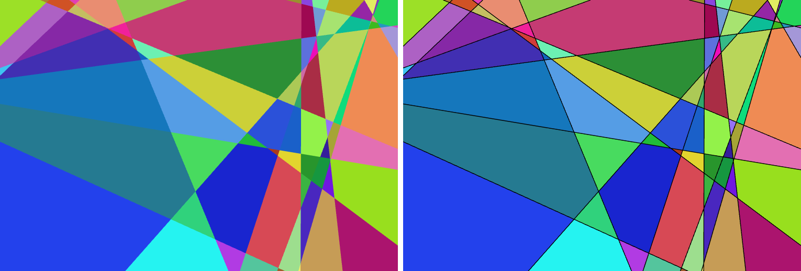

# Lines & Areas

A window full of infinite straight lines drifting and rotating. The lines cut the
plane into areas, and each area keeps **one constant random colour for its entire
life** — invented at the instant it is born, where three lines diverge from a
point, and destroyed at the instant it dies, where three converge on one.

**▶ Live version: <https://inhahe.github.io/lines/lines.html>**

Or just open `lines.html` locally — it's a single self-contained file with no
dependencies, no build step and no server needed.



*The same moment rendered both ways: colour areas only (left), and with the
black lines drawn on top (right).*

## Controls

| Control | Key | What it does |
|---|---|---|
| Show lines (black) | `L` | Draw the actual lines on top, or show only the colour areas (default: areas only) |
| GPU (WebGL) | `G` | Switch renderer between WebGL and Canvas2D |
| Lines | — | How many lines, 2–60 (default 40) |
| Drift speed | — | Scales how fast lines slide around |
| Rotation speed | — | Scales how fast lines turn |
| Reseed | `R` | Throw away everything and start a fresh random set |
| Pause | `Space` | Freeze the motion |
| ✕ / ☰ | `H` | Hide / show the control panel |

The panel's readout shows the number of areas currently on screen, the frame
rate, and which renderer is active.

## On a phone or tablet

It works as a full-screen touch app — no keyboard needed:

- The panel starts **hidden** on small or touch screens, so you get the artwork
  first. Tap the **☰** button in the corner to open it, and the **✕** in the
  panel (or a tap anywhere on the artwork) to hide it again.
- Every control is sized for fingers, and the panel is laid out to fit in
  portrait *and* landscape without scrolling.
- The canvas swallows touch scrolling and pull-to-refresh, and respects the
  notch / home-indicator safe areas.
- Rendering resolution is capped (device pixel ratio ≤ 2, plus a total-pixel
  ceiling) so a 3× phone screen doesn't quietly cost 9× the fill rate.

## URL options

Everything can be preset from the query string, e.g.
`lines.html?n=25&lines=1&seed=42`:

| Option | Meaning |
|---|---|
| `n=40` | Number of lines (2–60) |
| `lines=1` | Show the black lines (`0` = colour areas only) |
| `speed=1.5` | Drift speed multiplier (0–3) |
| `spin=0.4` | Rotation speed multiplier (0–3) |
| `gpu=0` | Force the Canvas2D renderer |
| `seed=123` | Reproduce an exact scene |
| `paused=1` | Start frozen |
| `hud=0` | Start with the panel hidden |

`?hud=0&lines=0` gives a clean full-screen colour-only view.

## How it works

Every line drifts and rotates at its own constant velocity, and **all of those
velocities are drawn from a bell curve** (a Box–Muller normal deviate), so most
lines move at a middling pace while a few are unusually fast or slow.

The interesting problem is giving each area a *stable identity*. An area changes
shape, size and even its number of corners every single frame, so matching
polygons between frames by position or overlap is fragile and drifts.

The trick is that in an arrangement of **infinite** lines, every area is exactly
the intersection of one half-plane per line — so it is uniquely identified by its
**sign vector**: which side of line 1 it's on, which side of line 2, and so on.
That vector never changes while the area exists, and the area exists precisely
when that combination of sides is non-empty. So the colour table is just a map
from sign vector to colour: a vector seen for the first time invents a colour,
and a vector that disappears has its colour forgotten. Birth and death fall out
automatically, with no event detection and no tolerance tuning.

When three lines pass through a common point, a triangle collapses to nothing and
is replaced by the opposite triangle — a genuinely different area, whose sign
vector differs in all three coordinates, so it correctly gets a brand new colour.

For the full design — including the two renderers, the off-window colour
tracking, and why a rotating line doesn't scramble the colours — see
[`design.md`](design.md).

## Development

| File | Role |
|---|---|
| `lines.html` | The whole app |
| `design.md` | Design notes and rationale |
| `test_geometry.js` | Test suite — `node test_geometry.js` |
| `bench.js` | Times the arrangement alone, in node |
| `bench.html` | Times arrangement + drawing; open in a real browser |

```
node test_geometry.js
```

64 checks covering the arrangement (face counts against Euler's formula, exact
area partitioning, unique sign vectors), the birth/death behaviour at a triple
point, the colour lifecycle, the Gaussian sampler, the seeded RNG, the colour
conversion shared by both renderers, the mobile device-pixel budget, and a
regression test for an fps-readout flicker bug.


## License

MIT - see [LICENSE](LICENSE). Free to use, modify and redistribute; provided
as-is, with no warranty.
